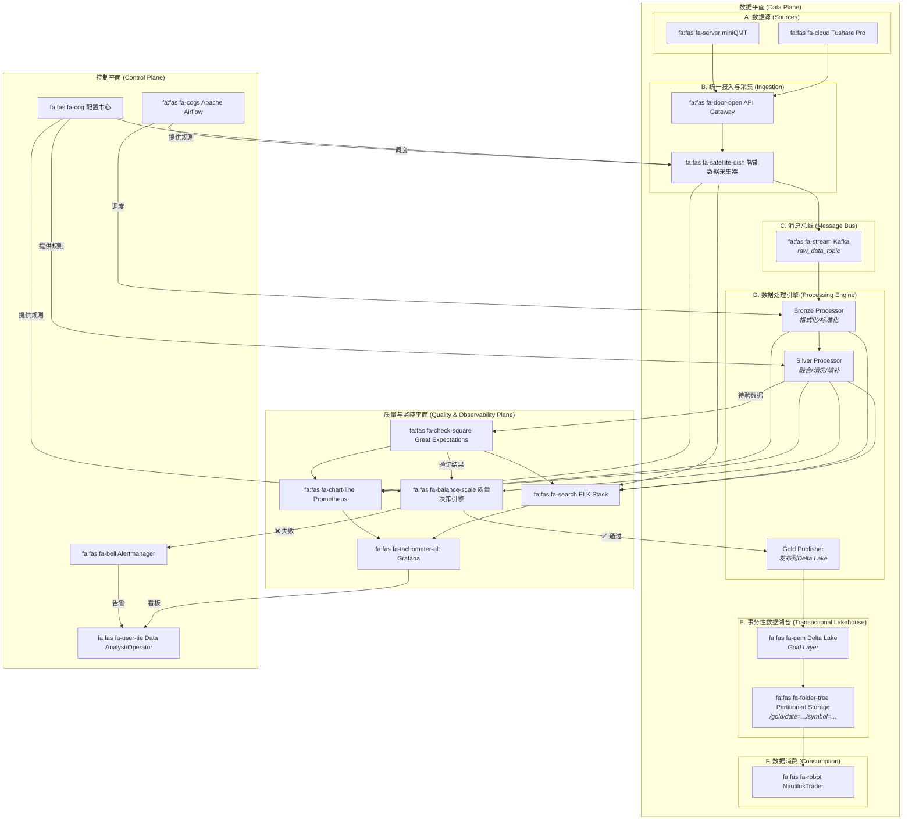
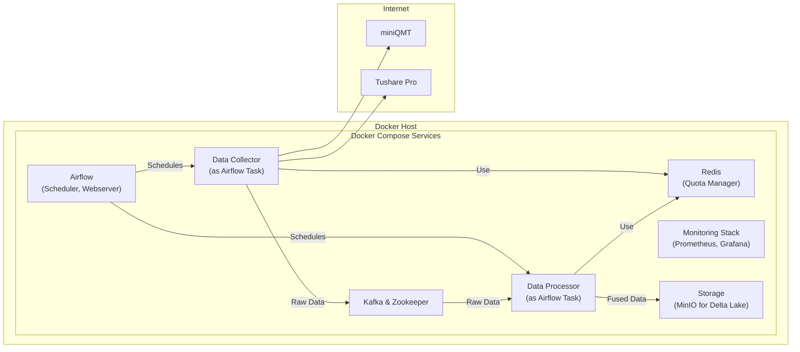

# Project Argus: 天枢计划


**天枢 (Tiānshū)** 是北斗七星之首，自古便是定位和导航的核心。这寓意着本项目是整个量化交易体系的**核心枢纽 (Central Hub)**，为所有策略提供稳定、可靠、可信的方向指引和数据基石。

**Argus** 在希腊神话中是拥有百眼的巨人，一个完美的守望者。这完美契合了项目全链路、多维度、自动化的质量监控体系 **(Observability)**，象征着系统拥有无数双眼睛，时刻守护着数据质量。

本项目旨在构建一个工业级、全自动、高韧性的A股数据管道系统，通过智能融合多源数据（miniQMT, Tushare Pro），为 **NautilusTrader** 量化交易系统提供可信赖的“黄金标准”数据。

## ✨ 核心特性 (Core Features)

*   **事件驱动与彻底解耦 (Event-Driven & Decoupled):** 以 **Apache Kafka** 为中央神经系统，实现极致的系统弹性和可扩展性。
*   **事务性数据湖仓 (Transactional Data Lakehouse):** 采用 **Delta Lake** 存储Gold层数据，提供ACID事务、时间旅行和Schema强制，从根本上保障数据一致性。
*   **智能多源融合 (Intelligent Multi-Source Fusion):** 遵循明确的治理规则，以miniQMT为主、Tushare为辅，智能融合行情、财务、公司行动等多维度数据，并提供完整的数据血缘。
*   **内建质量保障 (Quality Built-in):** 贯穿全链路的**五级质量监控架构**和**智能质量决策引擎 (QDE)**，由 **Great Expectations** 提供超过128条自动化规则支撑。
*   **全链路可观测性 (Comprehensive Observability):** 基于 **Prometheus, Grafana, ELK** 技术栈，提供覆盖数据源、管道、存储到应用的全方位监控与告警。
*   **自动化与高韧性 (Automation & High-Resilience):** 由 **Airflow** 实现自动化调度，具备Tushare配额熔断、自动故障转移等工业级韧性。

## 🏛️ 系统架构 (System Architecture)

本系统采用分层解耦的现代化数据平台架构，分为**数据平面**、**控制平面**和**质量与监控平面**，确保了系统的高内聚、低耦合和清晰的职责划分。



## 🛠️ 技术栈 (Technology Stack)

| 类别 | 技术 | 描述 |
| :--- | :--- | :--- |
| **部署与运行** | `Docker`, `Docker Compose` | 通过容器化实现环境一致性，支持一键部署和管理。 |
| **数据湖仓** | `Delta Lake`, `Apache Parquet` | 提供事务性、高性能的列式存储。 |
| **消息总线** | `Apache Kafka` | 作为事件驱动核心，解耦系统各组件。 |
| **工作流调度** | `Apache Airflow` | 自动化、可编程的工作流调度与监控。 |
| **数据质量** | `Great Expectations` | 声明式的数据质量断言、文档生成和报告。 |
| **数据处理** | `Python`, `Pandas`, `PyArrow`, `Prophet` | 高效的数据清洗、转换、融合与预测。 |
| **监控与告警** | `Prometheus`, `Grafana`, `Alertmanager`, `ELK` | 全链路的指标采集、可视化、告警和日志管理。 |
| **安全与配置**| `Docker Secrets`, `.env files`, `Consul` | 安全的凭证管理与动态的外部配置中心。 |

## ⚖️ 数据治理与质量 (Data Governance & Quality)

我们坚信**数据质量是量化交易的生命线**。Project Argus 将“质量内建”原则贯穿于数据生命周期的每个环节。

### 核心治理原则
1.  **数据源优先级原则 (Source Priority):** `miniQMT` 为行情主源，`Tushare` 为补充和备份源。
2.  **黄金标准层原则 (Golden Record):** 只有 `Gold` 层数据对外发布，严禁消费中间层。
3.  **完整数据血缘原则 (Data Lineage):** 所有融合字段必须记录其来源 (`_source`)。
4.  **质量内建原则 (Quality Built-in):** 每个字段都关联明确的质量校验规则。
5.  **Schema不可变与演进原则 (Schema Immutability):** Schema变更受严格的版本控制。

### 部署模型 (Docker Compose)
系统所有服务均被容器化，并通过`docker-compose.yml`进行编排，实现了开发的便捷性和部署的一致性。



## 🚀 快速开始 (Quick Start)

### 先决条件
*   [Docker](https://www.docker.com/get-started)
*   [Docker Compose](https://docs.docker.com/compose/install/)

### 安装与启动
1.  **克隆仓库**
    ```bash
    git clone https://github.com/your-org/project-argus.git
    cd project-argus
    ```

2.  **配置环境变量**
    复制示例环境文件，并填入您的Tushare Pro API Token。
    ```bash
    cp .env.example .env
    # 编辑 .env 文件，设置 TUSHARE_TOKEN
    # TUSHARE_TOKEN=your_tushare_pro_api_token
    ```

3.  **启动系统**
    使用 Docker Compose 一键启动所有服务。
    ```bash
    docker-compose up -d
    ```

4.  **访问服务**
    *   **Airflow UI:** `http://localhost:8080` (用于查看和管理DAGs)
    *   **Grafana:** `http://localhost:3000` (用于查看数据质量和系统监控看板)
    *   **MinIO Console:** `http://localhost:9001` (用于浏览Delta Lake数据)

## 📚 项目文档 (Project Documentation)

本项目采用全面的文档驱动开发模式。所有核心设计、规范和计划都有详细的文档支持，它们是理解本项目细节的**单一可信源 (Single Source of Truth)**。

| 文档名称 | 描述 |
| :--- | :--- |
| [`system_design.md`](./system_design.md) | **系统架构设计**：描述了系统的核心架构理念、组件和数据流。 |
| [`data_governance_and_dictionary.md`](./data_governance_and_dictionary.md) | **数据治理规范与字典**：定义了数据治理原则和Gold层数据字典。 |
| [`quality_kpi.md`](./quality_kpi.md) | **数据质量体系设计**：定义了质量KPI、评分模型和分层质量门禁。 |
| [`tushare_pro_integration_design.md`](./tushare_pro_integration_design.md) | **Tushare集成设计**：详细阐述了Tushare的接入、配额管理和容灾设计。 |
| [`plan.md`](./plan.md) | **项目计划书**：包含了项目的实施计划、里程碑和资源安排。 |
| [`requirements_traceability_matrix.md`](./requirements_traceability_matrix.md) | **需求追溯矩阵**：将所有需求与设计、开发、测试任务关联。 |
| [`user_story.md`](./user_story.md) | **用户故事全集**：从不同角色视角描述了项目的功能和价值。 |
| [`backlog.md`](./backlog.md) | **项目待办事项看板**：以看板形式可视化了详细的开发任务和依赖。 |
| [`risk_register.md`](./risk_register.md) | **风险登记册**：全面识别、评估并规划了项目中的所有潜在风险。 |

## 🤝 贡献指南 (Contributing)

我们欢迎任何形式的贡献！如果您想为 Project Argus 做出贡献，请遵循以下步骤：

1.  Fork 本仓库。
2.  创建一个新的功能分支 (`git checkout -b feature/your-feature-name`)。
3.  提交您的更改 (`git commit -am 'Add some feature'`)。
4.  将分支推送到您的Fork (`git push origin feature/your-feature-name`)。
5.  创建一个新的 Pull Request。

请确保您的代码遵循现有的编码风格，并通过所有测试。

## 📜 许可证 (License)

本项目采用 [MIT License](./LICENSE) 授权。
